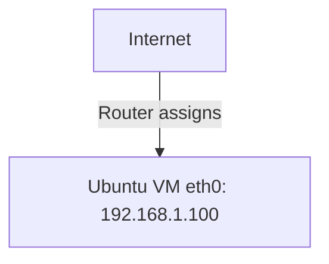
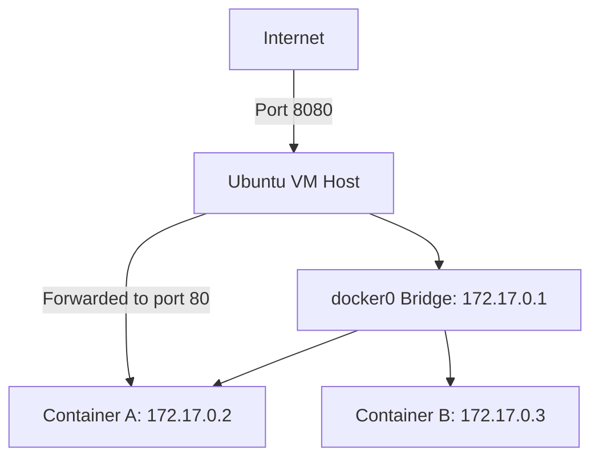
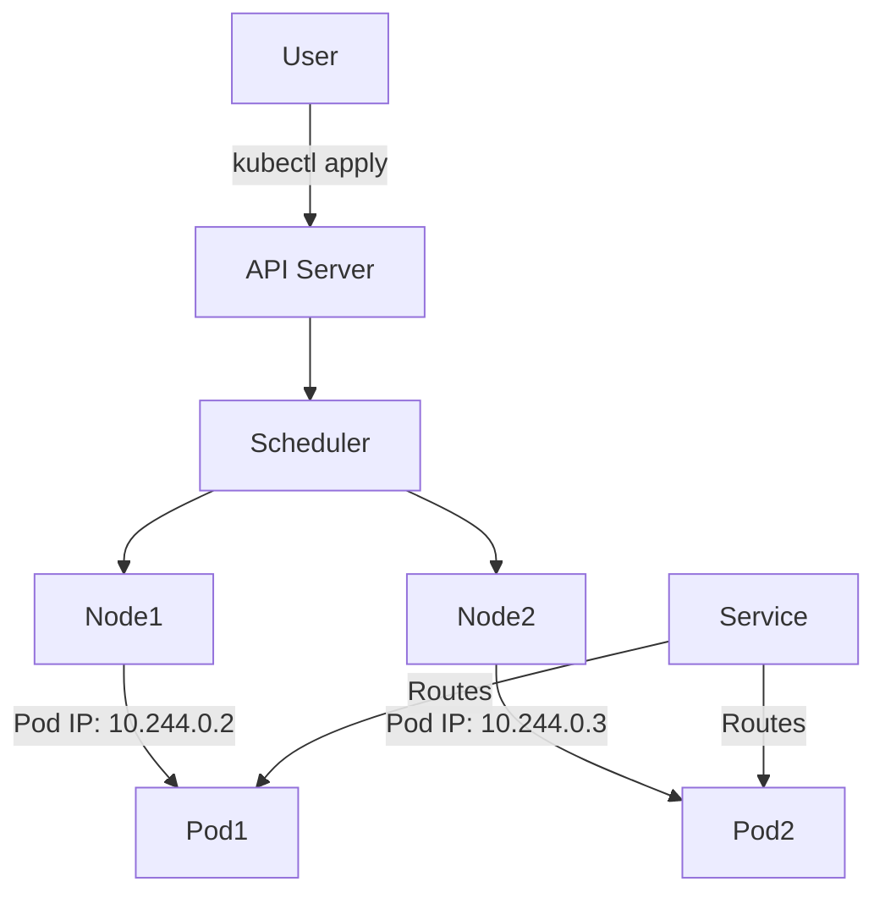
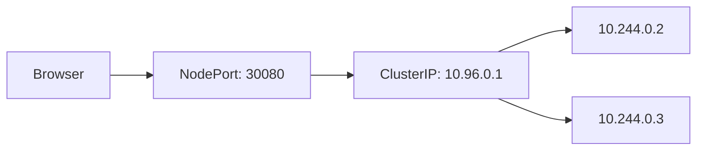

# 🔗 Networking Fundamentals for Containers, Kubernetes & OpenShift on Ubuntu

This guide is designed for beginners who want to truly understand **how IP addressing and networking work** behind the scenes when deploying applications using **Docker**, **Kubernetes**, and **OpenShift**, specifically on **Ubuntu VMs**.

---

## 🔗 1. IP Addressing Basics on Ubuntu

### 🔗 Check Your IP Address:

```bash
ip addr show
# OR
hostname -I
```

This will show your network interface and assigned IP address (for example, `192.168.122.101`).

### 🔗 Common Ubuntu Networking Tools

* `ip`: modern command to check and manipulate routes and addresses
* `netstat`: view ports in use
* `ss`: see which processes are using which sockets
* `ping`, `curl`, `wget`: useful for testing connectivity

---

## 🔗 2. Docker Networking on Ubuntu

When you install Docker on Ubuntu, it automatically creates a **bridge network** called `docker0`.

### 🔗 Docker Networking Overview:

```bash
docker network ls
```

Docker containers typically get an internal IP in the `172.17.0.0/16` range by default.

### 🔗 Diagram: Docker Default Bridge Network

```
  +---------------------------+
  |       Ubuntu Host        |
  |  IP: 192.168.122.101     |
  | +---------------------+  |
  | |     docker0:        |  |
  | |   172.17.0.1/16     |  |
  | +---------+-----------+  |
  |           |              |
  |     +-----v-----+        |
  |     | Container |        |
  |     | 172.17.0.2|        |
  |     +-----------+        |
  +---------------------------+
```

To run a container and expose a port:

```bash
docker run -d -p 8080:80 nginx
```

You can now access the app at `http://<your-vm-ip>:8080`

---

## 🔗 3. Kubernetes Networking on Ubuntu (via Minikube or kubeadm)

Kubernetes assigns **each Pod its own IP address** (from an internal range). It uses a **Container Network Interface (CNI)** plugin to handle IP addressing.

### 🔗 Diagram: Kubernetes Pod Networking

```
+---------------------------+
|     Ubuntu VM Host       |
|  IP: 192.168.122.101     |
|   +-------------------+  |
|   | kubelet & CNI     |  |
|   +----+----------+---+  |
|        |          |      |
|  +-----v--+   +---v----+ |
|  |  Pod1  |   |  Pod2  | |
|  |10.244.0.2|  |10.244.0.3| |
|  +--------+   +--------+ |
+---------------------------+
```

### 🔗 Useful Commands

```bash
kubectl get pods -o wide  # Shows pod IPs
kubectl get svc           # Shows services and their IPs
```

### 🔗 Service Exposure

To make your app accessible from outside the cluster:

```bash
kubectl expose deployment my-app --type=NodePort --port=80
```

Then access: `http://<vm-ip>:<node-port>`

---

## 🔗 4. OpenShift Networking (Overview)

OpenShift builds on Kubernetes and adds secure routes, internal DNS, and Service Mesh.

### 🔗 OpenShift App Routing Diagram

```
User (Browser)
     |
     v
Ingress / Route (HTTPS)
     |
     v
Service (ClusterIP)
     |
     v
Pod (App Container)
```

Use `oc get route` to find public-facing URLs for your services.

---

## 🔗 5. Example App Deployment Flow on Ubuntu

1. **Create Ubuntu VM** (on VirtualBox/Cloud)
2. **Install Docker/Kubernetes/OpenShift CLI**
3. **Pull or build container**:

```bash
docker build -t mywebapp .
```

4. **Run or deploy** the container:

```bash
docker run -d -p 8080:80 mywebapp
```

Or on Kubernetes:

```bash
kubectl apply -f deployment.yaml
```

5. **Expose and Access** via IP:

```bash
curl http://<vm-ip>:8080  # or nodePort IP
```

---

# 🔗 IP Addressing Explained Visually for Ubuntu + Containers

This section simplifies **how IP addressing works** when deploying containers using **Docker**, **Kubernetes**, and **OpenShift** on an Ubuntu virtual machine.

---

## 🔗 Ubuntu Host IP Basics



* Ubuntu gets its IP via DHCP or NAT.
* Use `ip addr` to find this.

---

## 🔗 Docker Networking - Bridge Mode



```bash
docker run -p 8080:80 myapp
```

Access the app via: `http://192.168.1.100:8080`

---

## 🔗 Kubernetes Networking

### Deployment Flow



### Service Exposure

```bash
kubectl expose deployment myapp --type=NodePort --port=80
```



---

## 🔗 OpenShift Routing

```mermaid
flowchart TD
    Browser --> Route[OpenShift Route (HTTPS)]
    Route --> Service[OpenShift Service]
    Service --> Pod[Application Pod]
```

Use `oc get routes` to retrieve the public-facing URL.

---

## 🔗 Summary Table

| Component        | Gets IP From    | Visible To         | Example IP    |
| ---------------- | --------------- | ------------------ | ------------- |
| Ubuntu Host      | LAN / NAT       | External network   | 192.168.1.100 |
| docker0 bridge   | Internal Docker | Host only          | 172.17.0.1    |
| Docker Container | docker0 network | Other containers   | 172.17.0.2    |
| Kubernetes Pod   | CNI plugin      | Cluster-wide       | 10.244.0.2    |
| K8s Service      | Kubernetes      | Cluster / NodePort | 10.96.0.1     |

---

## 🔗 Summary

Understanding how containers, pods, and services communicate using IP addresses is **essential** for any beginner working on Ubuntu. Whether it’s Docker’s bridge, Kubernetes CNI, or OpenShift’s Route model—everything starts with understanding the network path.

Would you like this turned into an illustrated PDF or Markdown doc with real screenshots next?
