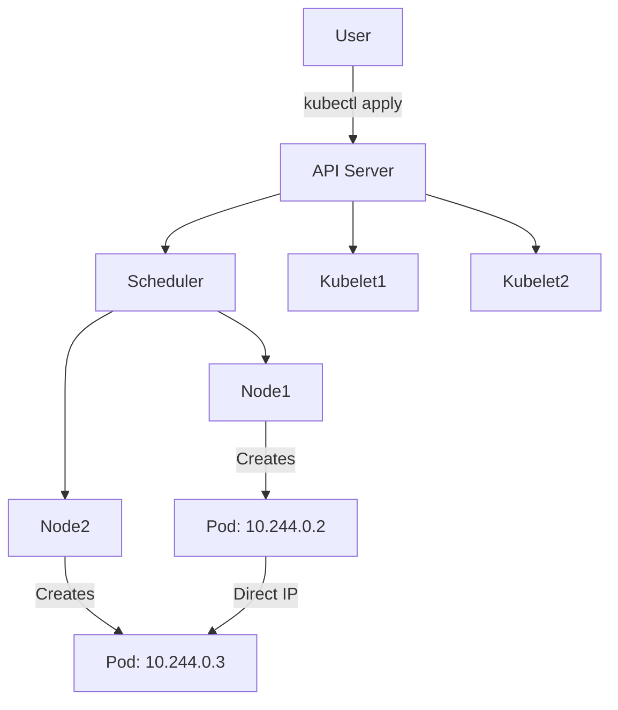
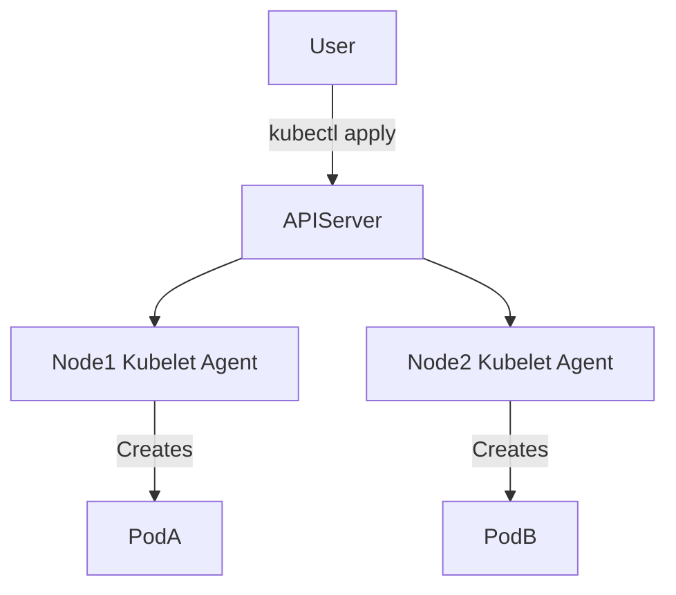
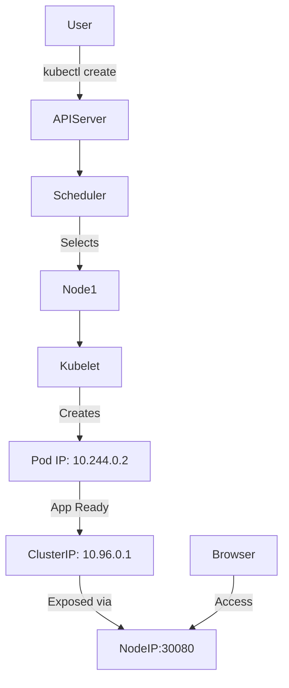

# 🔗 Deep Dive: How Kubernetes Networking Works

This section explains **how Kubernetes networking works** by breaking down each component of the Kubernetes control plane and its communication process using **IP addresses**, **services**, and **pod-to-pod communication** on an Ubuntu VM.

---

## 🔗 Core Components in Kubernetes Networking

### 1. **API Server** (the central brain)

* **What it is:** Acts like the receptionist of a Kubernetes cluster.
* **Role:** Receives commands (`kubectl apply`, etc.) and updates the cluster state.
* **IP:** Usually `localhost` inside master node (`127.0.0.1` or `10.x.x.x` if external).
* **Communicates with:** Scheduler, Controller Manager, kubelets, etc.

### 2. **Scheduler**

* **What it is:** Decides **where (which node)** a pod will run.
* **Role:** Based on CPU, RAM availability, affinity rules, etc.
* **How it works:**

  * Talks to the API server to get pending pods
  * Assigns them to nodes by writing binding info back to the API server

### 3. **Nodes (Workers)**

* **What they are:** The VMs or machines that run your **actual applications**.
* Each node runs:

  * **kubelet**: Talks to the API server
  * **kube-proxy**: Handles networking
  * **Container runtime**: (e.g. containerd, Docker)

### 4. **Pods**

* **What they are:** The smallest unit in Kubernetes. Like 1 or more containers sharing an IP and filesystem.
* **Each pod gets a unique IP**, usually in `10.244.0.x` range.
* Communicates directly with other pods **without NAT**.

### 5. **CNI (Container Network Interface)**

* **What it is:** A plugin responsible for assigning IPs to pods.
* **Popular CNI tools:** Flannel, Calico, Weave

---

## 🔗 Visual Diagram: Kubernetes Communication Flow



---

## 🔗 How IP Addresses Work

| Component  | Description                      | IP Example                       |
| ---------- | -------------------------------- | -------------------------------- |
| API Server | Cluster brain                    | 127.0.0.1 (internal) or 10.x.x.x |
| Pod        | Runs your app                    | 10.244.0.2                       |
| Service    | Stable front for a group of pods | 10.96.0.1                        |
| Node       | The Ubuntu VM or worker          | 192.168.1.100                    |
| NodePort   | Port exposed outside cluster     | 30080                            |

---

## 🔗 Example: What Happens When You Deploy an App

```bash
kubectl create deployment nginx --image=nginx
kubectl expose deployment nginx --type=NodePort --port=80
```

### Step-by-step:

1. You run `kubectl create` → API server receives this request
2. Scheduler picks a node and tells kubelet to run the Pod
3. CNI plugin assigns an IP like `10.244.0.2`
4. You expose the pod with `kubectl expose` → creates a **Service** with IP like `10.96.0.1`
5. Kubernetes assigns a **NodePort** like `30080`
6. You access the app at `http://<Ubuntu_VM_IP>:30080`

---

## 🔗 Detailed: Step-by-Step Kubernetes Networking Flow

### 1. 🔗 `kubectl create deployment nginx --image=nginx`

* You (the user) issue a command to create a deployment.
* This command is sent to the **API Server**, which is the front desk of the Kubernetes control plane.
* The API Server validates the command and stores the new deployment in **etcd** (the cluster database).

### 2. 🔗 Scheduler Selects a Node

* The **Scheduler** checks all available **worker nodes** in the cluster.
* It looks at available **CPU**, **memory**, and other criteria.
* It then selects a node (say, Node-1) and updates the deployment info in etcd.

### 3. 🔗 Kubelet Triggers Pod Creation

* On Node-1, the **kubelet** agent is constantly checking the API server.
* It sees it has a new pod to create and instructs the container runtime (e.g., `containerd`) to start the container.

### 4. 🔗 CNI Assigns a Pod IP

* The **Container Network Interface (CNI)** plugin (e.g., Flannel or Calico) assigns the new Pod an IP address.
* Example: `10.244.0.2`
* This IP is routable **within the cluster** but not accessible directly from outside.

### 5. 🔗 You Expose the Pod with a Service

```bash
kubectl expose deployment nginx --type=NodePort --port=80
```

* This creates a Kubernetes **Service** that acts like a stable virtual IP (VIP).
* The service is assigned a **ClusterIP** like `10.96.0.1`.
* It acts as a load balancer to forward traffic to the actual pod(s).

### 6. 🔗 NodePort Created

* Because you used `--type=NodePort`, Kubernetes now assigns a high external port (e.g., `30080`) on **every node** in the cluster.
* The **kube-proxy** component watches for this and ensures traffic to `NodeIP:30080` routes to the ClusterIP service, and then to the pod.

### 7. 🔗 Accessing the App from Outside

* Your Ubuntu VM has a public IP like `192.168.1.100`.
* You access the app in your browser:

```
http://192.168.1.100:30080
```

* The request hits the node → matches NodePort → routed to the Service (10.96.0.1) → forwarded to the Pod (10.244.0.2)

## 🔗 More on Kubernetes Concepts: Kubelet vs API Server & Kubelet1 vs Kubelet2

Understanding the **roles of the API server and kubelet**, and the difference between multiple kubelet agents in a cluster, is essential to grasp Kubernetes architecture. Here's a simple breakdown.

---

## 🔗 What is the API Server?

* It is the **central management gateway** of Kubernetes.
* Think of it as the "brain" or "traffic controller" of the cluster.
* It receives all commands via `kubectl`, REST APIs, etc.

### Role:

* Validates and processes requests (e.g., create deployment, scale pods)
* Stores/updates the desired state in **etcd** (the cluster's database)
* Communicates with all control-plane and worker components

### Location:

* Runs on the **control plane node(s)** only

---

## 🔗 What is a Kubelet?

* The **kubelet is an agent** that runs on **every worker node** (and optionally on control-plane nodes if they also run workloads).

### Role:

* Talks to the API server regularly
* Checks the desired state (e.g., "I need to run 2 nginx pods")
* Creates, monitors, and manages containers on the node using container runtime

---

## 🔗 Kubelet1 vs Kubelet2

These terms simply refer to **two different kubelets** running on **two different nodes** in the same cluster:

| Term     | Refers To                      |
| -------- | ------------------------------ |
| Kubelet1 | The kubelet agent on **Node1** |
| Kubelet2 | The kubelet agent on **Node2** |

Each kubelet is responsible **only for its node's health and workload**. They do not communicate with each other, only with the API server.

---

## 🔗 Communication Overview



## 🔗 What Are Nodes Like?

If you're thinking of Kubernetes in terms of physical infrastructure, **nodes are like virtual machines (VMs)** or physical servers. They are the workhorses that actually run your applications.

### Key Characteristics:

* A **node** can be a physical machine or a VM (e.g., an EC2 instance in AWS, a VM in VirtualBox).
* Every node runs:

  * `kubelet`: the agent that manages communication with the API server
  * `container runtime`: like Docker or containerd
  * `kube-proxy`: for handling network rules
* A node provides **CPU, memory, networking**, and **storage** to the containers running inside its pods.

### Analogy:

| Real-world Thing | Kubernetes Equivalent |
| ---------------- | --------------------- |
| Physical Server  | Node                  |
| Power Outlet     | Resources (CPU/RAM)   |
| Building         | Cluster of nodes      |

So if your pod is a "room," the **node is the house or apartment** where the room lives.

---

## 🔗 What Is Kubelet Like?

If a **node is like a virtual machine (VM)**, then the **kubelet is like a personal assistant or caretaker** living inside that VM.

### Analogy:

| Real-world Thing       | Kubernetes Equivalent |
| ---------------------- | --------------------- |
| Virtual Machine (VM)   | Node                  |
| Assistant in the VM    | Kubelet               |
| Manager outside the VM | API Server            |

### Key Responsibilities of Kubelet:

* Constantly checks the **API server** for instructions (like a walkie-talkie connection)
* Ensures that the required containers (within pods) are **running and healthy**
* Reports back the status (health, logs, metrics) of pods on its node
* Starts/stops pods using the **container runtime** (e.g., Docker, containerd)

### In Simple Terms:

> The kubelet is a **watchdog or caretaker** for your apps running on a specific machine (node). It does whatever the API server tells it to, but it’s focused entirely on its own house (node).

---

## 🔗 Does the Kubelet Assign IP Addresses?

**No, the kubelet does not assign IP addresses.** Instead, it relies on the **CNI (Container Network Interface)** plugin installed on the node.

### Here's what happens:

1. The **API server** tells the kubelet to create a pod.
2. The kubelet triggers the **container runtime** to create the container.
3. The kubelet calls the **CNI plugin** to assign an IP address to the pod (e.g., `10.244.0.2`).

### Analogy:

| Role       | Description                             |
| ---------- | --------------------------------------- |
| Node       | House/VM                                |
| Kubelet    | Caretaker in the house                  |
| CNI Plugin | Electrician that connects internet (IP) |
| Pod        | Room that gets wired (with IP)          |

So, while the kubelet manages and monitors the pod's lifecycle, **IP allocation is handled by the CNI plugin**.

> The kubelet is a **watchdog or caretaker** for your apps running on a specific machine (node). It does whatever the API server tells it to, but it’s focused entirely on its own house (node).

---

## 🔗 What Are Pods (Compared to Containers)?

If **nodes are like virtual machines (VMs)**, then **pods are like lightweight wrappers around containers**.

| Analogy               | Real Meaning                                   |
| --------------------- | ---------------------------------------------- |
| Node = VM             | A physical or virtual machine in the cluster   |
| Pod = Room in VM      | A logical unit that holds 1 or more containers |
| Container = Appliance | A single running app/process (e.g., NGINX)     |

### So, are Pods like Docker containers?

**Almost, but with a few key differences:**

* A **pod can contain multiple containers** (usually just one though).
* All containers in a pod **share the same IP address, network stack, and volumes**.
* Kubernetes manages pods, not containers directly.

Example:

* Docker runs: `docker run nginx`
* Kubernetes creates: `Pod → Container (nginx)`

So, Kubernetes uses pods to schedule, group, and manage containers.

### Can One Node Run Multiple Apps?

Absolutely! A single node can run many Pods (apps or microservices), **as long as it has enough resources** (CPU, RAM). Kubernetes will schedule them efficiently. There's no "one app per node" rule.

---

## 🔗 What Are Microservices?

**Microservices** are an architectural approach where a large application is broken into smaller, independent components (or "services"), each responsible for a specific functionality.

### For example:

If you build an online store, you might split it into:

* `frontend service`: handles user interface
* `product catalog service`: lists items
* `shopping cart service`: manages cart actions
* `payment service`: processes payments
* `order history service`: shows past orders

### Each of these:

* Can be **developed and deployed independently**
* Can scale up/down individually
* Has its own **container** and **Pod** in Kubernetes

### In Kubernetes:

Each microservice becomes:

* A **Deployment** that runs on one or more pods
* A **Service** that allows other microservices or users to reach it

This design is extremely common in cloud-native applications and enables fast, independent updates, scaling, and failure isolation.

---

## 🔗 Visual: Kubernetes Architecture & Control Plane

Here's a visual overview showing how Kubernetes is structured around control plane components and worker nodes:

````mermaid
flowchart TB
    subgraph Control_Plane
        API_Server[API Server]
        Scheduler[Scheduler]
        Controller[Controller Manager]
        Etcd[etcd Key-Value Store]
    end

    subgraph Worker_Node_1
        Kubelet1[Kubelet]
        KubeProxy1[kube-proxy]
        Pod1[Pod A]
        Pod2[Pod B]
    end

    subgraph Worker_Node_2
        Kubelet2[Kubelet]
        KubeProxy2[kube-proxy]
        Pod3[Pod C]
    end

    User[DevOps (kubectl)]
    User --> API_Server
    API_Server --> Scheduler
    API_Server --> Controller
    API_Server --> Etcd
    API_Server --> Kubelet1
    API_Server --> Kubelet2
    Scheduler --> Kubelet1
    Scheduler --> Kubelet2
    Kubelet1 --> Pod1
    Kubelet1 --> Pod2
    Kubelet2 --> Pod3
```mermaid
flowchart TB
    subgraph CP [Control Plane (Master Node)]
        API[API Server]
        SCH[Scheduler]
        CM[Controller Manager]
        ETCD[etcd (Key-Value Store)]
    end

    subgraph Node1 [Worker Node 1]
        K1[Kubelet1]
        Proxy1[kube-proxy]
        PodA[Pod A]
        PodB[Pod B]
    end

    subgraph Node2 [Worker Node 2]
        K2[Kubelet2]
        Proxy2[kube-proxy]
        PodC[Pod C]
    end

    User[User or DevOps via kubectl]
    User --> API
    API --> SCH
    API --> CM
    API --> ETCD
    API --> K1
    API --> K2
    SCH --> K1
    SCH --> K2
    K1 --> PodA
    K1 --> PodB
    K2 --> PodC
````

### 🔗 What This Diagram Shows:

* Control plane components live on the **master node**.
* The **API Server** is the central hub of communication.
* Each **worker node** has a `kubelet` that receives pod instructions.
* **Pods** are the actual workloads (apps) that run inside the nodes.
* Communication flows from user → API server → kubelets → pods.

---

## 🔗 How Many Kubelets Can Be Created and What Do They Depend On?

### 🔗 Answer:

* **You can create one kubelet per node.**
* So, the number of kubelets = number of nodes in your cluster.
* There's **no strict upper limit** imposed by Kubernetes for the number of kubelets, but it's bounded by:

  * Cluster size limits (up to **5000 nodes** in a production-grade cluster)
  * Available system resources
  * Control plane scalability

---

### 🔗 What Does the Kubelet Depend On?

1. **The Node**:

   * The kubelet must run on a node (VM or physical machine).
   * It requires access to the container runtime (e.g., containerd, Docker).

2. **The API Server**:

   * Kubelet continuously polls the API Server for the desired state (e.g., what pods should run).

3. **The CNI Plugin**:

   * For networking and assigning IPs to pods.
   * Without a functioning CNI, kubelet can create pods, but they won’t have network access.

4. **Permissions and Config**:

   * The kubelet must be authenticated to the API Server.
   * It needs a valid `kubeconfig` file.

---

### 🔗 Real-World Scaling Example

Imagine a SaaS company running a large-scale video processing platform:

* They deploy their services on a Kubernetes cluster with **200 nodes**.
* Each node has 1 kubelet → **200 kubelets total**.
* These kubelets run thousands of pods (e.g., video encoding workers).

The cluster scales horizontally by adding nodes (and thus, kubelets). Kubernetes handles workload distribution automatically through the scheduler.

---

### 🔗 Takeaway

* **Kubelet is 1:1 with each node**.
* It acts as a smart local agent that listens to the central API server and manages containers.
* As you scale your cluster, kubelets scale automatically — each new node brings its own kubelet.


### In brief:

* **API Server** is the boss – sits in the control plane
* **Kubelets** are workers – one per node, listening and acting on orders from API Server
* **Kubelet1 and Kubelet2** are just individual agents on different nodes

---

## 🔗 Real-World Example: How a Company Uses Kubernetes

Let’s say **Company A** is a fintech startup with a web app that includes:

* A **frontend** (React)
* A **backend API** (Node.js)
* A **database** (PostgreSQL)
* A **payment service** (Python microservice)

### Here's how they might deploy everything with Kubernetes:

* They have a cluster with **1 control plane node** (API server, etcd, scheduler) and **3 worker nodes**.

#### Step-by-Step Breakdown:

1. They create **4 Deployments**:

   * One for the frontend
   * One for the backend API
   * One for the database (with PersistentVolume)
   * One for the payment service

2. Kubernetes assigns **each Deployment to different Nodes** based on resource availability (decided by the **scheduler**).

3. Each app (container) is run **inside its own Pod**.

   * Pods for frontend might run on **Node 1**
   * Backend API might run on **Node 2**
   * DB pods with persistent storage might run on **Node 3**

4. Each Pod gets its own **IP address**, and communication between services is managed using **Services** (ClusterIP or NodePort).

5. All Pods are monitored by their node’s **kubelet**, which reports back to the API server.

6. External users access the app via a **LoadBalancer or NodePort** that routes to the frontend. Absolutely! A single node can run many Pods (apps or microservices), **as long as it has enough resources** (CPU, RAM). Kubernetes will schedule them efficiently. There's no "one app per node" rule.

---

## 🔗 How Is a Kubernetes Cluster Created (And How Many Can You Have?)

### 🔗 Single Command to Create a Cluster

If you're starting locally or for development purposes, this command creates a quick Kubernetes cluster:

```bash
minikube start
```

* Sets up a **single-node Kubernetes cluster** with all components (API server, scheduler, etc.)
* Ideal for learning and experimenting

For production setups:

```bash
kubeadm init
```

* Initializes the **control plane**
* Then you add more nodes using `kubeadm join`

---

### 🔗 Is a Cluster Created After That?

Yes! Once the **API server and kubelet are running**, your **cluster exists**. Even with just one node, it's a valid Kubernetes cluster.

---

### 🔗 How Many Clusters Can You Create?

There’s no strict limit defined by Kubernetes itself:

| Context            | Cluster Limit                     |
| ------------------ | --------------------------------- |
| Local Machine      | 1–3 (depends on RAM, CPU)         |
| Cloud Providers    | 100s or more (e.g., AWS, GCP)     |
| Enterprise Systems | 1000s (requires management tools) |

Each cluster runs independently and you can use `kubectl config use-context` to switch between them.

---

### 🔗 Analogy Recap

| Action                | What It Means                          |
| --------------------- | -------------------------------------- |
| `minikube start`      | Instantly spins up a learning cluster  |
| `kubeadm init` + join | Builds a scalable production cluster   |
| Multiple clusters     | Each has its own API, nodes, pods, IPs |

---

## 🔗 Real-World Example: How a Company Uses Kubernetes

Let’s say **Company A** is a fintech startup with a web app that includes:

* A **frontend** (React)
* A **backend API** (Node.js)
* A **database** (PostgreSQL)
* A **payment service** (Python microservice)

### Here's how they might deploy everything with Kubernetes:

* They have a cluster with **1 control plane node** (API server, etcd, scheduler) and **3 worker nodes**.

#### Step-by-Step Breakdown:

1. They create **4 Deployments**:

   * One for the frontend
   * One for the backend API
   * One for the database (with PersistentVolume)
   * One for the payment service

2. Kubernetes assigns **each Deployment to different Nodes** based on resource availability (decided by the **scheduler**).

3. Each app (container) is run **inside its own Pod**.

   * Pods for frontend might run on **Node 1**
   * Backend API might run on **Node 2**
   * DB pods with persistent storage might run on **Node 3**

4. Each Pod gets its own **IP address**, and communication between services is managed using **Services** (ClusterIP or NodePort).

5. All Pods are monitored by their node’s **kubelet**, which reports back to the API server.

6. External users access the app via a **LoadBalancer or NodePort** that routes to the frontend.

---

## 🔗 Summary Diagram



## 🔗 In Summary:

* **Pods talk to each other directly** using their IPs, thanks to CNI.
* **Services group pods** and provide **stable IPs**.
* **NodePorts expose services** to the outside world.
* The API server orchestrates the entire communication using control-plane components.

Would you like this section merged into your main IP Networking README with visuals?
