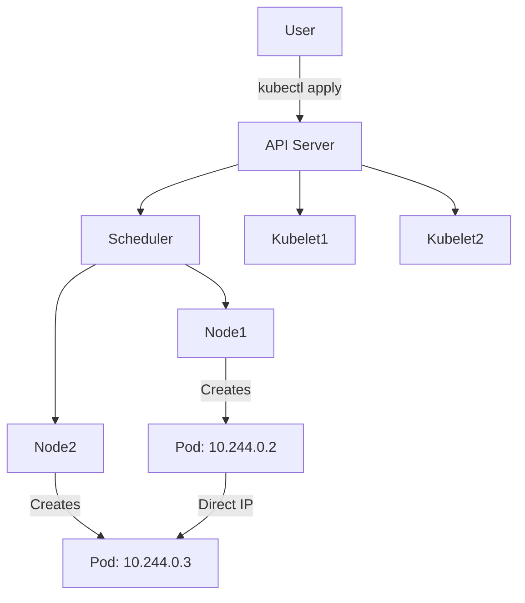

# 🔗 Deep Dive: How Kubernetes Networking Works (Beginner-Friendly)

This section explains **how Kubernetes networking works** by breaking down each component of the Kubernetes control plane and its communication process using **IP addresses**, **services**, and **pod-to-pod communication** on an Ubuntu VM.

---

## 🔗 Core Components in Kubernetes Networking

### 1. **API Server** (the central brain 🧠)

* **What it is:** Acts like the receptionist of a Kubernetes cluster.
* **Role:** Receives commands (`kubectl apply`, etc.) and updates the cluster state.
* **IP:** Usually `localhost` inside master node (`127.0.0.1` or `10.x.x.x` if external).
* **Communicates with:** Scheduler, Controller Manager, kubelets, etc.

### 2. **Scheduler**

* **What it is:** Decides **where (which node)** a pod will run.
* **Role:** Based on CPU, RAM availability, affinity rules, etc.
* **How it works:**

  * Talks to the API server to get pending pods
  * Assigns them to nodes by writing binding info back to the API server

### 3. **Nodes (Workers)**

* **What they are:** The VMs or machines that run your **actual applications**.
* Each node runs:

  * **kubelet**: Talks to the API server
  * **kube-proxy**: Handles networking
  * **Container runtime**: (e.g. containerd, Docker)

### 4. **Pods**

* **What they are:** The smallest unit in Kubernetes. Like 1 or more containers sharing an IP and filesystem.
* **Each pod gets a unique IP**, usually in `10.244.0.x` range.
* Communicates directly with other pods **without NAT**.

### 5. **CNI (Container Network Interface)**

* **What it is:** A plugin responsible for assigning IPs to pods.
* **Popular CNI tools:** Flannel, Calico, Weave

---

## 🔗 Visual Diagram: Kubernetes Communication Flow



---

## 🔗 How IP Addresses Work

| Component  | Description                      | IP Example                       |
| ---------- | -------------------------------- | -------------------------------- |
| API Server | Cluster brain                    | 127.0.0.1 (internal) or 10.x.x.x |
| Pod        | Runs your app                    | 10.244.0.2                       |
| Service    | Stable front for a group of pods | 10.96.0.1                        |
| Node       | The Ubuntu VM or worker          | 192.168.1.100                    |
| NodePort   | Port exposed outside cluster     | 30080                            |

---

## 🔗 Example: What Happens When You Deploy an App

```bash
kubectl create deployment nginx --image=nginx
kubectl expose deployment nginx --type=NodePort --port=80
```

### Step-by-step:

1. You run `kubectl create` → API server receives this request
2. Scheduler picks a node and tells kubelet to run the Pod
3. CNI plugin assigns an IP like `10.244.0.2`
4. You expose the pod with `kubectl expose` → creates a **Service** with IP like `10.96.0.1`
5. Kubernetes assigns a **NodePort** like `30080`
6. You access the app at `http://<Ubuntu_VM_IP>:30080`

---

## 🔗 In Summary:

* **Pods talk to each other directly** using their IPs, thanks to CNI.
* **Services group pods** and provide **stable IPs**.
* **NodePorts expose services** to the outside world.
* The API server orchestrates the entire communication using control-plane components.

Would you like this section merged into your main IP Networking README with visuals?
